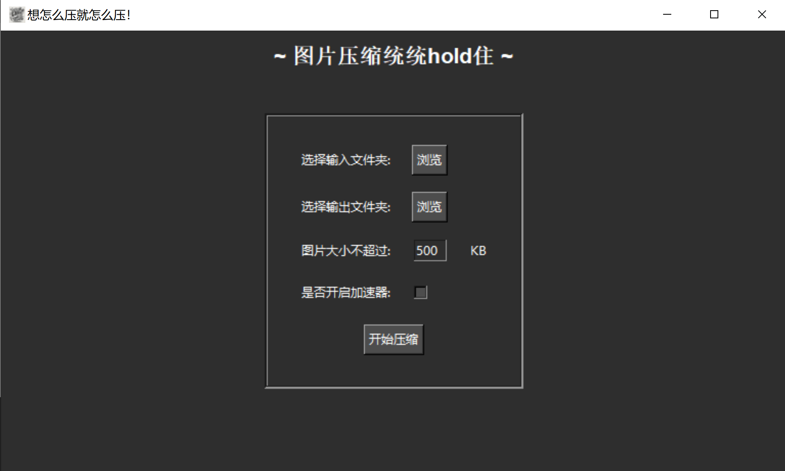

# compress_image

一款好用的免费的图片压缩工具

### Windows系统打包方式

pyinstaller.exe -F --windowed --icon=logo.ico --add-data "logo.ico;." compress_image.py

告别收费压缩图片....

支持文件夹嵌套递归查找，且按输入文件夹结构输出；

自定义设置图片压缩的大小；

支持加速压缩，高速压缩，放心压缩！

